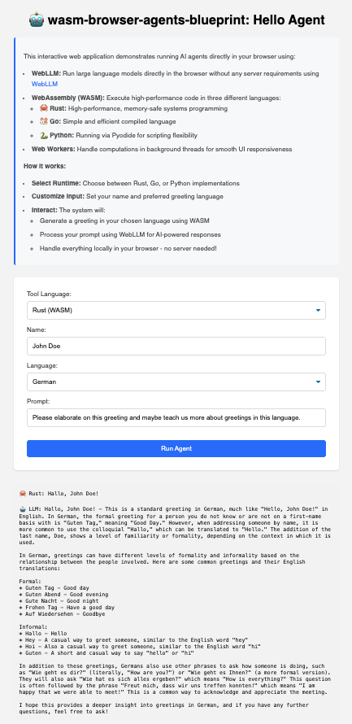

<p align="center">
  <picture>
    <!-- When the user prefers dark mode, show the white logo -->
    <source media="(prefers-color-scheme: dark)" srcset="./images/Blueprint-logo-white.png">
    <!-- When the user prefers light mode, show the black logo -->
    <source media="(prefers-color-scheme: light)" srcset="./images/Blueprint-logo-black.png">
    <!-- Fallback: default to the black logo -->
    
  </picture>
</p>

<div align="center">


[](LICENSE)
[](https://discord.gg/YuMNeuKStr)

[Blueprints Hub](https://developer-hub.mozilla.ai/)
| [Documentation](docs/)
| [Getting Started](#quick-start)
| [Contributing](CONTRIBUTING.md)

</div>

# wasm-browser-agents-blueprint

This blueprint demonstrates how to build browser-native AI agents using WebAssembly (WASM) and WebLLM. It showcases the integration of multiple programming languages (Rust, Go, Python, JavaScript) to create high-performance, browser-based AI applications that run entirely client-side without server dependencies.

<p align="center">
  <picture>
    <!-- When the user prefers dark mode, show the white logo -->
    <source media="(prefers-color-scheme: dark)" srcset="./images/headline.png">
    <!-- When the user prefers light mode, show the black logo -->
    <source media="(prefers-color-scheme: light)" srcset="./images/headline.png">
    <!-- Fallback: default to the black logo -->
    
  </picture>
</p>

## Quick Start

### 🐳 Recommended: Docker Deployment
```bash
# Build and run with Docker (Recommended)
docker build -t wasm-browser-agents-app .

# Run with recommended settings
docker run -p 5173:5173 \
  --gpus all \  # If GPU is available
  --memory=8g \  # Recommended for running larger models
  --shm-size=1g \  # Shared memory for better worker performance
  wasm-browser-agents-app

# For development with hot-reload
docker run -p 5173:5173 \
  -v $(pwd)/demos:/app/demos \
  -v $(pwd)/src:/app/src \
  wasm-browser-agents-app
```

The Docker setup automatically handles:
- All required language toolchains (Rust, Go, Python)
- WASM compilation tools and dependencies
- Model management and resource allocation
- Development environment configuration

### Docker Requirements and Recommendations

- **Minimum Requirements**:
  - 4GB RAM
  - 10GB disk space
  - Docker 20.10.0 or higher

- **Recommended Setup**:
  - 8GB+ RAM for running larger models
  - NVIDIA GPU with CUDA support
  - Docker Compose for development
  - WSL2 on Windows systems

- **Resource Considerations**:
  - Rust agent with f32 models: 6GB+ VRAM
  - Go agent with balanced models: 4-5GB VRAM
  - Python agent: 2-4GB VRAM
  - JavaScript agent: 1-2GB VRAM

- **Development Tips**:
  - Use volume mounts for hot-reload during development
  - Monitor Docker stats for resource usage
  - Clear Docker cache periodically when switching models

### Alternative: Manual Setup
If you prefer to run without Docker, you can set up manually:

```bash
# Clone the repository
git clone https://github.com/mozilla-ai/wasm-browser-agents-blueprint.git
cd wasm-browser-agents-blueprint

# Install dependencies
npm install

# Build WASM modules
chmod +x build.sh
./build.sh

# Start development server
npm run dev

# Build for production
npm run build
```

Note: Manual setup requires installing all language toolchains and dependencies separately. See [Pre-requisites](#pre-requisites) section for details.

Visit `http://localhost:5173` to see the application in action.

## How it Works

The blueprint implements a multi-language WASM architecture that enables:

1. **Language-Agnostic WASM Integration**
   - Rust modules for high-performance computations
   - Go modules for efficient concurrent operations
   - Python modules via Pyodide for flexible scripting

2. **Browser-Native AI Processing**
   - WebLLM integration for client-side LLM inference
   - Agent-specific LLM model selection:
     - Rust: High-precision models optimized for performance (e.g., DeepSeek 8B f32)
     - Go: Balanced models for concurrent operations (e.g., Qwen2 7B)
     - Python: Research and experimental models (e.g., Phi-2)
     - JavaScript: Lightweight, responsive models (e.g., TinyLlama)
   - Web Workers for non-blocking background processing
   - Comlink for seamless Web Worker communication
   - Real-time text generation and processing

3. **Modern Web Architecture**
   - Vite-based build system
   - ES modules for clean dependency management
   - Web Workers with Comlink for type-safe concurrent processing

## Pre-requisites

- **System requirements**:
  - OS: Windows, macOS, or Linux
  - Node.js 18.0 or higher
  - Modern web browser with WebAssembly support
  - Minimum RAM: 4GB
  - Disk space: 1GB for full development setup

- **Development Dependencies**:
  - Rust toolchain (latest stable)
  - Go 1.18 or higher
  - Python 3.10 or higher
  - npm or yarn package manager

## Project Structure

```
browser-agents-blueprint/
├── demos/
│   └── hello-agent/      # Main demo application
├── src/
│   ├── rust/            # Rust WASM implementation
│   │   └── build.sh     # Rust-specific build script
│   ├── go/              # Go WASM implementation
│   │   └── build.sh     # Go-specific build script
│   ├── python/          # Python/Pyodide implementation
│   │   └── build.sh     # Python-specific build script
│   └── js/              # JavaScript implementation
│       └── build.sh     # JavaScript-specific build script
├── dist/                # Compiled WASM modules
├── docs/                # Documentation
├── build.sh            # Main build script for all modules
├── package.json         # Node.js dependencies and scripts
└── Dockerfile          # Container configuration
```

## Build Process

The project includes individual build scripts for each language implementation:

1. **Rust Build (`src/rust/build.sh`)**
   - Installs `wasm-pack` if not present
   - Compiles Rust code to WASM using `wasm-pack`
   - Outputs to `dist/rust/`

2. **Go Build (`src/go/build.sh`)**
   - Requires Go 1.18+
   - Compiles Go code to WASM
   - Copies necessary WASM support files
   - Outputs to `dist/go/`

3. **Python Build (`src/python/build.sh`)**
   - Prepares Python files for Pyodide
   - Manages Python dependencies
   - Outputs to `dist/python/`

The root `build.sh` script orchestrates the build process for all modules. When using Docker, these build steps are automatically handled by the Dockerfile.

## Features

- **WebLLM Integration**: 
  - Run large language models directly in your browser
  - Agent-specific model optimization
  - Dynamic model switching with automatic resource management
- **Multi-Language WASM Support**:
  - 🦀 **Rust**: High-performance, memory-safe systems programming with f32 precision models
  - 🐹 **Go**: Simple and efficient concurrent language with balanced model performance
  - 🐍 **Python**: Running via Pyodide for flexible scripting and experimental models
  - 📜 **JavaScript**: Native browser implementation with lightweight models
- **Web Workers**: Background processing for smooth UI responsiveness
- **Comlink Integration**: Type-safe and ergonomic Web Worker communication
- **Modern UI/UX**: Clean, responsive interface with consistent styling

## Troubleshooting

Common issues and solutions:

- **WASM Loading Issues**
  - Ensure your browser supports WebAssembly
  - Check console for detailed error messages
  - Verify WASM files are being served with correct MIME types

- **Build Problems**
  - Verify all required toolchains are installed
  - Check Node.js version compatibility
  - Clear npm cache and node_modules if needed

- **Performance Issues**
  - Try different WASM implementations (Rust recommended for best performance)
  - Monitor browser console for memory usage
  - Check Web Worker initialization status

## License

This project is licensed under the Apache 2.0 License. See the [LICENSE](LICENSE) file for details.

## Contributing

We welcome contributions! Please see our [Contributing Guidelines](CONTRIBUTING.md) for details on:

- Code of Conduct
- Development process
- How to submit changes
- How to report issues
- Community guidelines 